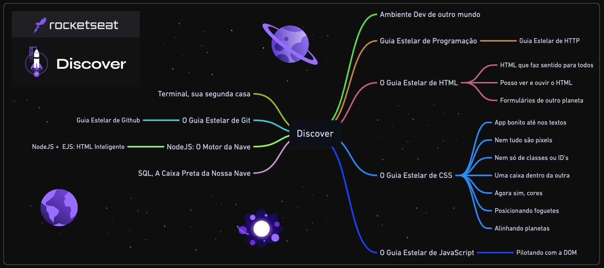
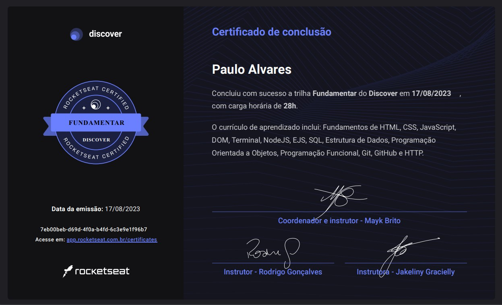
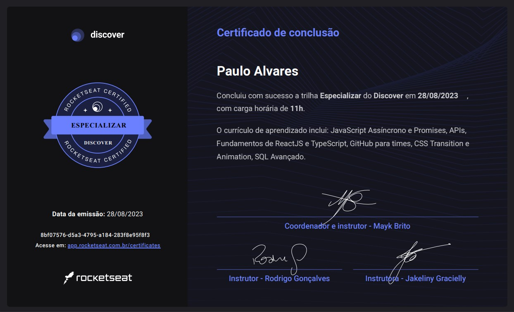

  
  <h3 align="center">Discover - Rocketseat</h3>

# 🔍Visão Geral
  Esta formação oferece 3 trilhas voltadas para desenvolvimento web, cobrindo desde os fundamentos iniciais de HTML, CSS e JavaScript até tecnologias mais avançadas, como React, Node.js e TypeScript. Além disso, aprofunda o conhecimento em bancos de dados com SQLite e no uso de ferramentas de versionamento e colaboração, como Git e GitHub. Meu objetivo é dominar essas tecnologias essenciais e aplicá-las de forma eficiente em projetos web, criando aplicações modernas, escaláveis e com boas práticas de desenvolvimento, tanto no front-end quanto no back-end.

# 📚Conteúdo Abordado
  * **Conectar:** Introdução aos conceitos fundamentais de tecnologia, oferecendo uma visão geral dos termos e jargões comuns da área, além de explorar as principais áreas de atuação e os diferentes papéis que os profissionais desempenham no mercado.

  * **Fundamentar:** Prática aplicada das principais tecnologias, abrangendo desde o desenvolvimento de páginas web com HTML até a manipulação de Bancos de Dados com SQL, criando uma base sólida para o entendimento técnico.

  * **Especializar:** Expansão e aprofundamento dos conhecimentos adquiridos anteriormente, com foco em tópicos avançados e específicos, permitindo a especialização em áreas mais complexas da tecnologia.

  

  <h3>💻Tecnologias Aprendidas</h3>
  

# 🏅Certificados

# 🔗Recursos Adicionais
### 🔧Ferramentas
  - <a href="https://code.visualstudio.com/download">Visual Studio Code</a>
  - <a href="https://www.beekeeperstudio.io/get">Beekeeper Studio</a>

### 📦Linguagens e Pacotes
  - <a href="https://nodejs.org/en/download/package-manager">Node.Js</a>
  - <a href="https://git-scm.com/downloads">Git</a>

### 📖Guias de Referência
  - <a href="https://developer.mozilla.org/en-US/docs/Web/HTML">HTML</a>
  - <a href="https://developer.mozilla.org/en-US/docs/Web/CSS">CSS</a>
  - <a href="https://developer.mozilla.org/en-US/docs/Web/JavaScript">JavaScript</a>
  - <a href="https://nodejs.org/docs/latest/api/">Node.Js</a>
  - <a href="https://ejs.co/#docs">EJS</a>
  - <a href="https://www.w3schools.com/sql/">SQL</a>
  - <a href="https://git-scm.com/doc">Git</a>
  - <a href="https://docs.github.com">GitHub</a>
  - <a href="https://developer.mozilla.org/en-US/docs/Web/HTTP">HTTP</a>
  - <a href="https://legacy.reactjs.org/docs/getting-started.html">React</a>
  - <a href="https://www.typescriptlang.org/docs/">TypeScript</a>

### 📎Curso
  - <a href="https://loiane.training/curso/java-basico">Java Básico</a>
  - <a href="https://app.rocketseat.com.br/certificates/84b41404-7b5f-4e75-a7f4-2d5684a2085c">Validação do Certificado Conectar</a>
  - <a href="https://app.rocketseat.com.br/certificates/7eb00beb-d69d-4f0a-b4fd-6c3e9e1f96b7">Validação do Certificado Fundamentar</a>
  - <a href="https://app.rocketseat.com.br/certificates/8bf07576-d5a3-4795-a184-283f8e95f8f3">Validação do Certificado Especializar</a>

# 📬Contato

 
  
  
   
  
  
  

